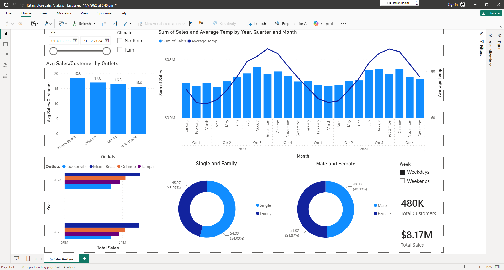

# 🛍️ Florida Retail Store Sales Analysis

> **End-to-End Data Analytics Project using Google BigQuery, SQL & Microsoft Power BI**



# 📌 Project Overview

Retail businesses generate large amounts of sales, customer, and operational data every day. However, when this information exists in separate datasets, it becomes difficult to identify trends, evaluate store performance, and make informed business decisions.

This project demonstrates an **end-to-end retail analytics workflow** by integrating **Sales**, **Customer Survey**, and **Weather** datasets using **Google BigQuery** and **SQL**, followed by the development of an interactive **Power BI dashboard**.

The dashboard enables stakeholders to monitor key performance indicators, compare store performance, analyze customer demographics, evaluate weather impacts, and support data-driven business decisions.

---

# 🎯 Project Objectives

- Integrate multiple retail datasets into a single analytics-ready dataset.
- Analyze retail sales performance across multiple stores.
- Compare customer demographics and purchasing behavior.
- Evaluate weather influence on sales.
- Create an interactive business dashboard using Power BI.
- Demonstrate an end-to-end data analytics workflow.

---

# 📂 Dataset

This project combines three datasets representing different aspects of retail operations.

| Dataset | Description |
|----------|-------------|
| **Sales** | Daily retail sales transactions from four Florida stores |
| **Customer Survey** | Customer demographic information |
| **Weather** | Daily weather observations |

### Key Columns

### Sales

- Date
- Shop ID
- Shop Name
- Customers
- Sales (USD)

### Customer Survey

- Date
- Male %
- Female %
- Family %
- Single %

### Weather

- Date
- Average Temperature
- Humidity
- Rain Indicator
- Precipitation

---

# 🔄 Project Workflow

```text
               Raw Excel Files
                      │
                      ▼
           Google BigQuery
       (Import & Data Storage)
                      │
                      ▼
            SQL Data Processing
      • Data Cleaning
      • Table Joins
      • Feature Engineering
      • Derived Columns
                      │
                      ▼
        Analytics Ready Dataset
                      │
                      ▼
             Microsoft Power BI
      • Data Modeling
      • KPI Development
      • Interactive Dashboard
                      │
                      ▼
            Business Insights
```

---

# 💼 Business Problem

Retail organizations often store sales, customer, and operational information across multiple systems. This makes it difficult to answer important business questions such as:

- Which store performs the best?
- Which customers spend the most?
- Does weather affect daily sales?
- Are weekends more profitable than weekdays?
- How can staffing and inventory be optimized?

This project solves these challenges by integrating multiple datasets into a single analytical model and presenting insights through an interactive Power BI dashboard.

---

# 🛠️ Tools Used

| Tool | Purpose |
|------|---------|
| Microsoft Excel | Raw datasets |
| Google BigQuery | Data warehouse |
| SQL (GoogleSQL) | Data cleaning & transformation |
| Microsoft Power BI | Dashboard & visualization |
| Visual Studio Code | SQL development |
| Git | Version control |
| GitHub | Project hosting |

---

# ⚙️ Data Pipeline

### Step 1

Import raw Excel datasets into **Google BigQuery**

↓

### Step 2

Explore the datasets using SQL

↓

### Step 3

Join Sales, Survey, and Weather tables

↓

### Step 4

Perform feature engineering

- Day of Sale
- Week Type
- Week Number
- Average Sales per Customer
- Year

↓

### Step 5

Create the final analytics-ready dataset

↓

### Step 6

Import into Microsoft Power BI

↓

### Step 7

Build an interactive dashboard

---

# 📊 Dashboard Preview

> **Power BI Dashboard**


---

# 📈 Key Performance Indicators (KPIs)

The dashboard provides the following KPIs:

- 💰 Total Sales
- 👥 Total Customers
- 📈 Average Sales per Customer
- 🌡️ Average Temperature
- 🏪 Store Performance
- 📅 Sales Trend Over Time
- 👨 Male vs Female Customers
- 👨‍👩‍👧 Family vs Single Customers
- 🌧️ Weather Impact on Sales
- 📆 Weekday vs Weekend Sales

---

# 💡 Business Insights

### 🏪 Store Performance

- Miami Beach generated the highest average sales per customer at **[$18.6]**, compared to **[$15.5]** at Jacksonville — a **[20.00%]** difference.
- Jacksonville recorded the lowest average sales per customer among the four stores.

---

### 📈 Sales Trends

- 2023 sales dipped in **[February]** at **[$393,336.80]**, and peaked to their highest in **[August]** at **[$602,619.34]**.
- 2024 sales dipped in **[February]** at **[$399,392.21]**, and peaked to their highest in **[August]** at **[$606,273.60]**.
- Seasonal patterns particularly around **[August]** show a **[54.14%]** swing in monthly sales.

---

### 👨‍👩‍👧 Customer Demographics

- Customers split **[48.96%]** male and **[51.04%]** female across the dataset.
- Family shoppers made up **[47.68%]** of customers versus **[52.32%]** single shoppers, with the largest gap seen at **[Miami Beach]**.

---

### 🌧️ Weather Analysis

- Sales dropped **[0.99%]** on days with recorded rainfall compared to clear days.
- Average temperatures above **[75°F]** were associated with a **[28.3%]** increase in daily customer footfall compared with days at or below **[75°F]**.

---

### 📆 Shopping Behavior

- Weekend sales were **[13.12%]** higher than weekday sales, averaging **[$4,428.89]** per day versus **[$3,915.07]** on weekdays.
- **[Miami Beach]** showed the strongest weekend vs. weekday gap, suggesting staffing could be adjusted accordingly.

---

# 📁 Folder Structure

```text
Florida-Shop-Data-Analysis/
│
├── Dashboards/
│   └── Sales_Dashboard.png
│
├── Data/
│   └── (raw sales, survey, and weather datasets)
│
├── Notebooks/
│   └── (exploratory / analysis notebooks)
│
├── Sql/
│   ├── 01_explore_data.sql
│   ├── 02_data_join.sql
│   ├── 03_create_final_table.sql
│   └── 04_analysis_queries.sql
│
├── Reports/
│   └── Project_Report.pdf
│
├── images/
│
├── Readme.md
├── package.txt
└── .gitignore
```

---

# 🚀 How to Run

## 1. Clone the repository

```bash
git clone https://github.com/Madhav-tech1212/Florida-Shop-Data-Analysis.git
```

---

## 2. Import datasets

Import the Sales, Survey, and Weather datasets into **Google BigQuery**.

---

## 3. Execute SQL scripts

Run the SQL files in the following order:

```text
01_explore_data.sql

↓

02_data_join.sql

↓

03_create_final_table.sql

↓

04_analysis_queries.sql
```

---

## 4. Export the processed dataset

Export the final dataset from Google BigQuery.

---

## 5. Open Power BI

Import the processed dataset into Microsoft Power BI.

---

## 6. Refresh Dashboard

Refresh the visuals to view the latest analytics.

---

# 📚 Skills Demonstrated

- SQL
- Google BigQuery
- Data Cleaning
- Data Integration
- Feature Engineering
- Data Transformation
- KPI Development
- Dashboard Design
- Data Visualization
- Business Analytics
- Data Storytelling
- Git & GitHub

---

# 🚀 Future Improvements

Future versions of this project could include:

- Direct Power BI to BigQuery connection
- Automated dashboard refresh
- Real-time data streaming
- Executive KPI dashboard
- Inventory analytics
- Product-level analysis
- Customer segmentation
- Sales forecasting
- Machine Learning integration
- Automated reporting

---

# 📖 Project Report

A detailed project report explaining the complete workflow, SQL transformations, dashboard design, and business insights is available below.

```text
Reports/Project_Report.pdf
```

---

# 🙋 Author

## Madhav Karthickk I

**Data Analyst**

Specializing in:

- SQL
- Google BigQuery
- Power BI
- Python
- Data Analytics
- Business Intelligence

🌐 **Portfolio**
https://www.madhavk.com/

💼 **LinkedIn**
https://www.linkedin.com/in/madhavkarthickki

🐙 **GitHub**
https://github.com/Madhav-tech1212

---

## ⭐ If you found this project helpful, consider giving it a Star!

It helps showcase the project and supports my learning journey in Data Analytics.